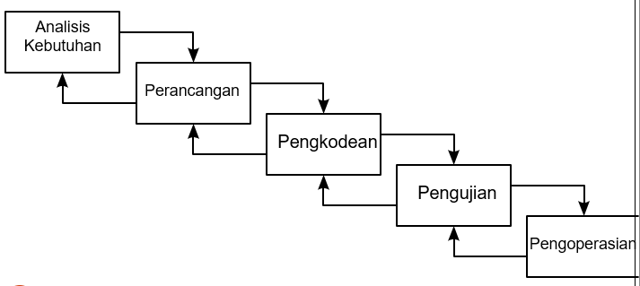

# Metodologi Pengembangan Perangkat Lunak

### 1. Metode Waterfall
---
Metode waterfall adalah salah satu jenis model pengembangan aplikasi dan termasuk ke dalam classic life cycle (siklus hidup klasik), yang mana menekankan pada fase yang berurutan dan sistematis. perbedaan dari metode waterfall dengan metode agile terletak pada tahapan SDLC -nya. Model ini juga termasuk ke dalam pengembangan perangkat lunak yang terbilang kurang iteratif dan fleksibel. Karena, proses yang mengarah pada satu arah saja seperti air terjun.

##### Tahapan Waterfall
1. Analisis kebutuhan : Tahapan metode waterfall yang pertama adalah mempersiapkan dan menganalisa kebutuhan dari software yang akan dikerjakan.
2. Perancangan : pembuatan desain aplikasi sebelum masuk pada proses coding.
3. Pengkodean : pada tahap pengkodean ini lebih berfokus pada hal teknis, dimana hasil dari desain perangkat lunak akan diterjemahkan ke dalam bahasa pemrograman melalui tim programmer atau developer. 
4. Pengujian : akan dilakukan penggabungan modul yang sudah dibuat pada tahap sebelumnya. Setelah proses integrasi sistem telah selesai, berikutnya masuk pada pengujian modul.
5. Pengoperasian : Setelah dilakukan pengujian sistem, maka akan masuk pada tahap produk dan pemakaian perangkat lunak oleh pengguna (user).

##### Kelebihan & kekurangan
Kelebihan : Mudah dalam pengelolaan proyek, dokumen dihasilkan setiap akhir fase, fase dijalankan setelah fase sebelumnya selesai, struktur sistem jelas.

Kelemahan : Proyek dunia nyata jarang mengikuti alur proses, Kesulitan jika terjadi perubahan kebutuhan, waktu pengerjaan bertambah, dll.

