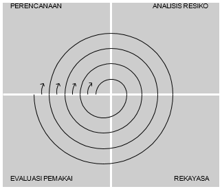

# Metodologi Pengembangan Perangkat Lunak

### 1. Metode Waterfall
---
Metode waterfall adalah salah satu jenis model pengembangan aplikasi dan termasuk ke dalam classic life cycle (siklus hidup klasik), yang mana menekankan pada fase yang berurutan dan sistematis. perbedaan dari metode waterfall dengan metode agile terletak pada tahapan SDLC -nya. Model ini juga termasuk ke dalam pengembangan perangkat lunak yang terbilang kurang iteratif dan fleksibel. Karena, proses yang mengarah pada satu arah saja seperti air terjun.

##### Tahapan Waterfall
1. Analisis kebutuhan : Tahapan metode waterfall yang pertama adalah mempersiapkan dan menganalisa kebutuhan dari software yang akan dikerjakan.
2. Perancangan : pembuatan desain aplikasi sebelum masuk pada proses coding.
3. Pengkodean : pada tahap pengkodean ini lebih berfokus pada hal teknis, dimana hasil dari desain perangkat lunak akan diterjemahkan ke dalam bahasa pemrograman melalui tim programmer atau developer. 
4. Pengujian : akan dilakukan penggabungan modul yang sudah dibuat pada tahap sebelumnya. Setelah proses integrasi sistem telah selesai, berikutnya masuk pada pengujian modul.
5. Pengoperasian : Setelah dilakukan pengujian sistem, maka akan masuk pada tahap produk dan pemakaian perangkat lunak oleh pengguna (user).

##### Kelebihan & kelemahan
* Kelebihan : Mudah dalam pengelolaan proyek, dokumen dihasilkan setiap akhir fase, fase dijalankan setelah fase sebelumnya selesai, struktur sistem jelas.
* Kelemahan : Proyek dunia nyata jarang mengikuti alur proses, Kesulitan jika terjadi perubahan kebutuhan, waktu pengerjaan bertambah, dll.

### 2. Spiral
---
Metode spiral menggabungkan dua metode pengembangan, yaitu prototype dan waterfall. Pengembang melaksanakan prototyping dengan cara sistematis khas metode waterfall. Umumnya metode spiral diterapkan dalam pengembangan perangkat lunak berskala besar, sekaligus membutuhkan sistem yang kompleks. Setiap prosesnya selalu disertai dengan analisis mendalam mengenai tingkat risiko dan keberhasilan pengembangan.

##### Kelebihan & Kelemahan
* Kelebihan : Dapat digunakan untuk sistem yang besar, sangat cocok sebagai mekanisme mengurangi resiko
* Kelemahan : terlalu banyak memikirkan resiko yang akan terjadi, masih jarang digunakan

### 3. Metode Agile
---
Metode agile merupakan induk dari scrum. Jika scrum adalah kerangka kerja, agile adalah pelaksanaan proyek secara keseluruhan yang berskala besar. Metode ini tergolong modern, karena menekankan pada improvisasi dan adaptasi. Meskipun begitu, alur kerjanya masih menerapkan pola tradisional yang sistematis. 

Salah satu kunci dari agile adalah dokumentasi pekerjaan. Dokumentasi harus tersusun rapi dan terstruktur. Hal ini berkaitan erat dengan metode agile yang bersifat adaptif terhadap perubahan fenomena pengguna perangkat lunak.

##### Kelebihan & kekurangan
* Kelebihan : Jika berorientasi pada kepuasan pengguna, metode agile menyediakan prosedur yang tepat. Demikian halnya pada proyek besar yang membutuhkan pemeliharaan jangka panjang. Metode agile menguntungkan dari segi efisiensi waktu dan tenaga.

Keunggulan metode agile juga terletak pada adaptasi dan kebebasan bagi pengembang untuk melakukan improvisasi
* Kekurangan : Tantangan terbesar akan dihadapi pengembang yang terus dipacu untuk beradaptasi dengan perubahan zaman. Tim pengembangan tidak boleh asal pilih, harus solid dan sama-sama berkomitmen kuat.